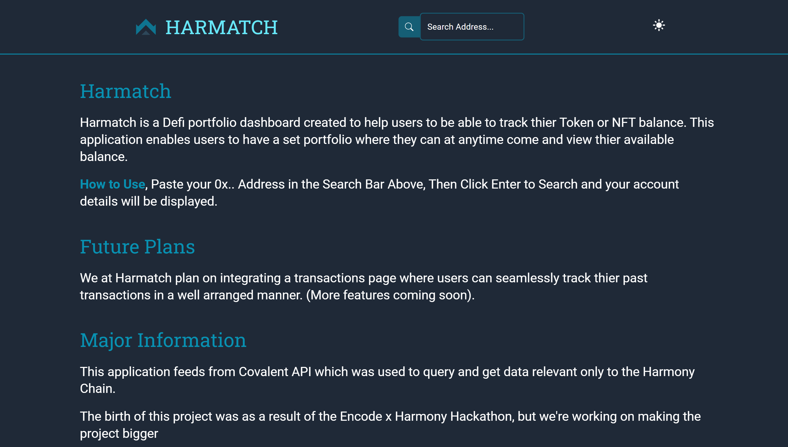
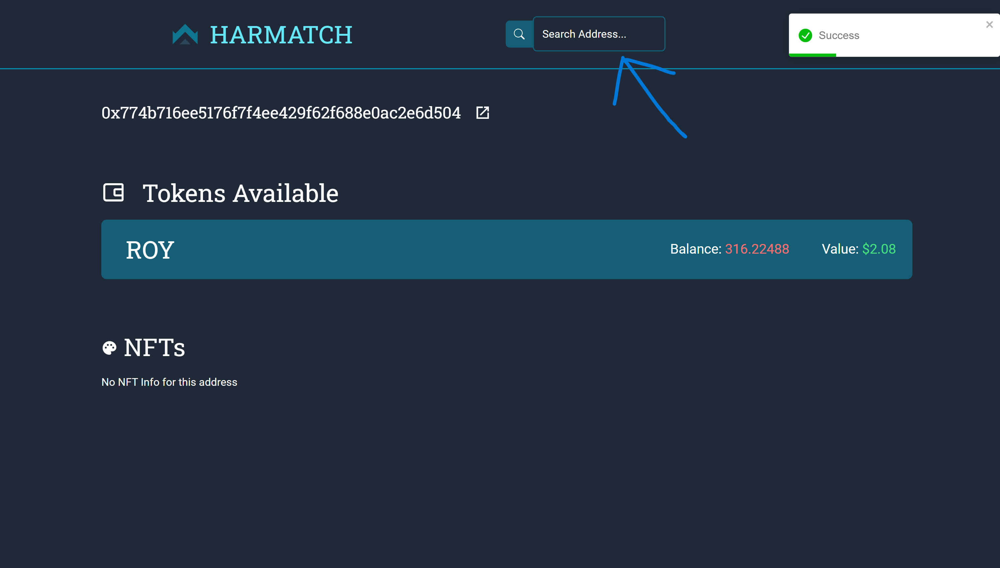

# Harmatch



A Project for the Encode x Harmony x Covalent Hackathon

### Useful Links

-   Visit the Website through this link : [https://harmatch.netlify.app/](https://harmatch.netlify.app/)
-   Demo Video (Youtube) : [https://youtu.be/weh7nVW76JI](https://youtu.be/weh7nVW76JI)

## Getting Started with Harmatch

[Harmatch](https://harmatch.netlify.app/) is a DeFi dashboard that allows users to search their address and view their token holdings and balance, also available is the ability for users to view their NFT holdings and their balance(s) and price if available.

## How to use Harmatch



All you need to do is paste your 0x.. Address in the Search Bar on the [home page](https://harmatch.netlify.app/), then press Enter or click the search button to Search and your account details will be displayed, If you do not have any token or NFT nothing will be displayed.

**NOTE:**

All data displayed are gotten from [Covalent](https://www.covalenthq.com/docs/) which provides industry-leading Unified API that brings visibility to billions of Web3 data points and they have different EndPoints provided.

Used in this project is a newly featured endPoint to get token balances for an address and its available in [Covalent Class A Endpoint](https://www.covalenthq.com/docs/api/#/0/Get%20token%20balances%20for%20address/USD/1).

## Do you wish to have the code?
You can clone the repo by running this command
```
git clone https://github.com/AfolabiOlajide/Harmatch.git
```
after which you need to install the dependencies by running this command
```
npm i
```
or
```
npm install
```
before you install make sure you have a stable connection, when it is done installing you can now run this command to view the project live on your system
```
npm start
```

### Tech Stack


